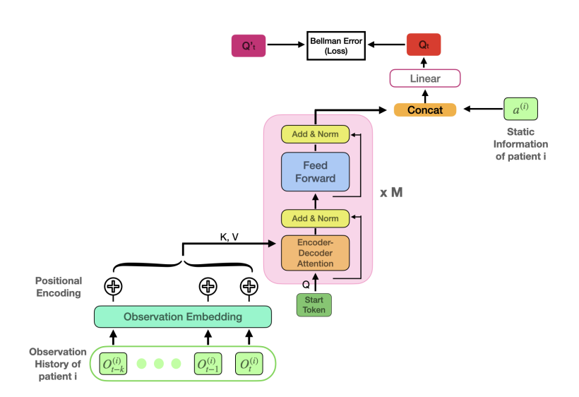

# Deep Attention Q-Network for Drug Recommendation

This project implements a drug recommendation system using reinforcement learning, specifically comparing a standard Deep Q-Network (DQN) and a Deep Attention Q-Network (DAQN). The goal is to recommend the most effective drug to a patient based on both static and time-series health data.



## 📌 Project Structure

```
.
├── DQN/                          # DQN model, environment, data processor
├── DAQN/                         # DAQN model, attention-based architecture
├── trained_models/               # Saved model checkpoints
├── plots/                        # Generated performance plots
├── pipelines.py                  # Experiment pipelines (comparison, ablations, testing)
├── main.py                       # Entry point for running tests and evaluations
├── README.md                     # Project documentation
└── requirements.txt              # Dependencies
```

## 🧠 Models

- **DQN (Deep Q-Network)**: Uses a feedforward neural network and single patient snapshot to predict drug actions.
- **DAQN (Deep Attention Q-Network)**: Incorporates Transformer decoder to attend over patient time-series data for more informed decision making.

## 🧪 Pipelines

- `compare_DAQN_vs_DQN`: Evaluate overall performance of DAQN vs DQN.
- `run_DAQN_epsilon_comparator`: Compare fixed and variable epsilon strategies.
- `run_DAQN_gamma_comparator`: Analyze effect of discount factor (γ) values.
- `test_model`: Load trained model and recommend drugs for real test patient profiles.

## 🧬 Data

- **Patient Data**:
  - DQN uses individual snapshots: `patient_data_1000.csv`
  - DAQN uses sequences: `patient_data_1000_timeseries.csv`
- **Drug Data**:
  - Contains drug ID, name, effectiveness, conditions, contraindications, and side effects.

## 🚀 How to Run

1. Clone the repository
   ```bash
   git clone https://github.com/rialibb/Deep-Attention-Q-Network-for-Drug-Recommendation.git
   cd Deep-Attention-Q-Network-for-Drug-Recommendation
   ```

2. Install dependencies (ideally in a virtual environment)
   ```bash
   pip install -r requirements.txt
   ```

3. Train or test the model
   ```bash
   python main.py  # You can configure it to run specific pipeline
   ```

4. View results in the `plots/` directory.

## 📈 Results Summary

- DAQN shows improved performance over DQN due to sequence modeling.
- Variable epsilon strategy leads to better exploration-exploitation balance.
- Discount factor γ has limited effect due to single-step reward design.

## 🛠 Requirements

- matplotlib 
- torch 
- numpy 
- gym
- scikit-learn
- pandas
- tqdm

## 🤝 Acknowledgements

This project is inspired by the paper:

> **"Deep Attention Q-Network for Personalized Treatment Recommendation"**  
> *Simin Ma, Junghwan Lee, Nicoleta Serban, Shihao Yang*  
> [arXiv:2209.09428](https://arxiv.org/abs/2307.01519)

We gratefully acknowledge the authors for their foundational contribution.